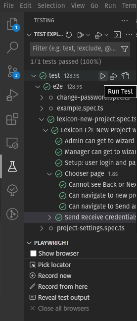

# Debugging Playwright tests

## VS Code Extension (simplest)

The [_Playwright Test for VSCode_](https://marketplace.visualstudio.com/items?itemName=ms-playwright.playwright) extension is the easiest way to run individual tests or test suites. It covers the vast majority of standard debugging use cases and supports debugging directly in VS Code.

You can run or debug tests from the side bar:

> Note: the application will start automatically if it's not already running.
> This could take some time and doesn't provide a lot of output.

Or directly from the spec files (right-click for more options e.g. debug):

Notice the useful options in the test side bar above:

- `Show browser` for running tests in headed mode
- `Reveal test output` for viewing test logs

> Note: the extension can become unstable if there are compilation errors in the code.

## Playwright CLI

Standard usage:

- From root: `pnpx playwright test -c ./test/e2e/playwright.config.ts [other options]`
- Or simply: `pnpm run test-e2e [-- other options]`

Tips:

- `test-e2e-report` opens the latest [HTML report](https://playwright.dev/docs/trace-viewer-intro#opening-the-html-report) with results, traces & screenshots (valuable for debugging after the fact)
- [`await page.pause()`](https://playwright.dev/docs/api/class-page#page-pause) acts as a breakpoint in `--headed` and `--debug` mode
- [Playwright's debugging inspector](https://playwright.dev/docs/debug#playwright-inspector) provides a toolkit for debugging Playwright locators. It is available in [`--debug`](https://playwright.dev/docs/debug#--debug) mode or by using `await page.pause()` in `--headed` mode
- Test for flakiness by running tests multiple times `--repeat-each <N>` and only running specific tests with [`test.only(...)`](https://playwright.dev/docs/next/test-annotations#focus-a-test) or [`test.skip(...)`](https://playwright.dev/docs/next/test-annotations#skip-a-test)

For a full list of options see the [official docs](https://playwright.dev/docs/test-cli).

## Gotchas

- For performance reasons, we persist user sessions in `storageState.json` files, so that we can reuse them across tests and test executions. These are automatically removed when starting the server and automatically created if they do not exist. If the sessions become invalid they can lead to peculiar test failures. Remove them with `make clean-test`.
